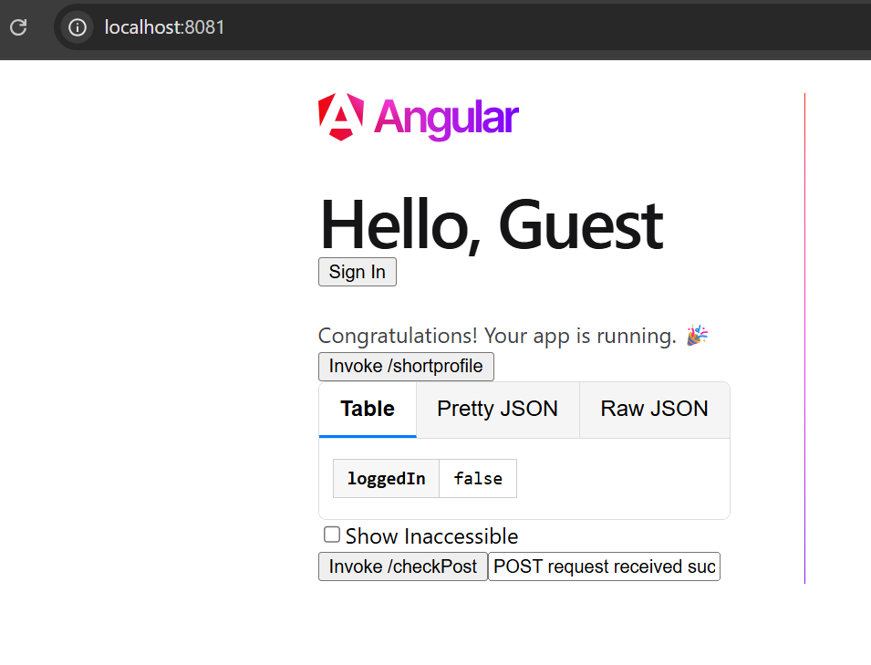
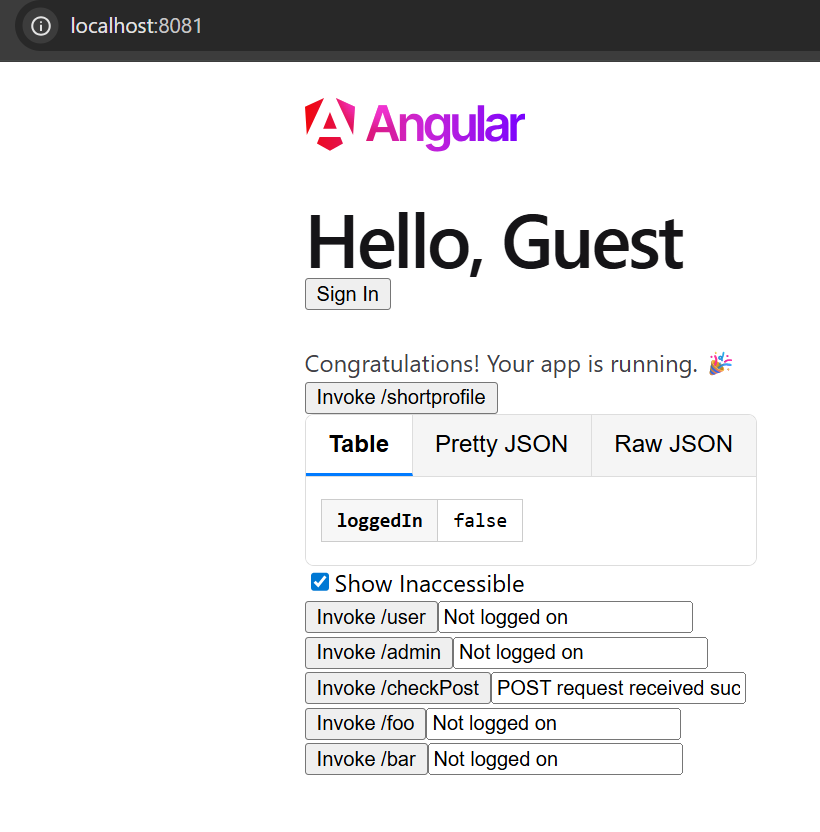
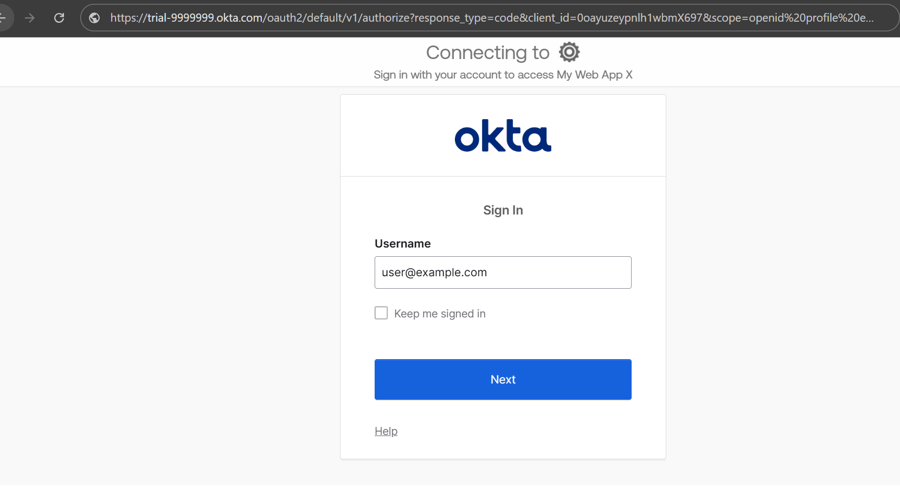
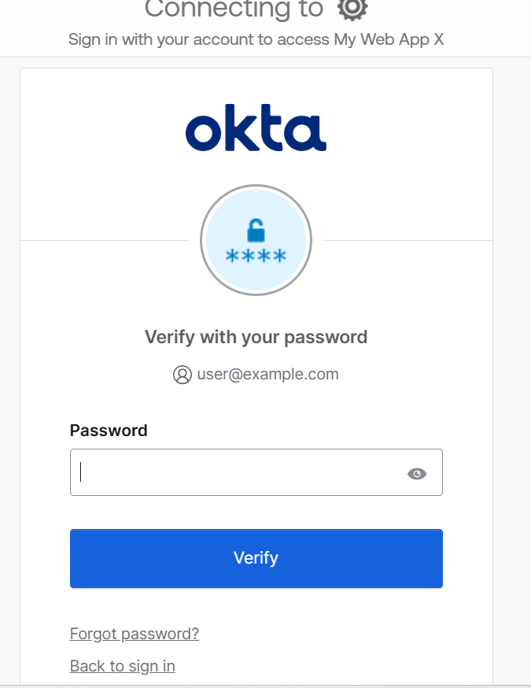
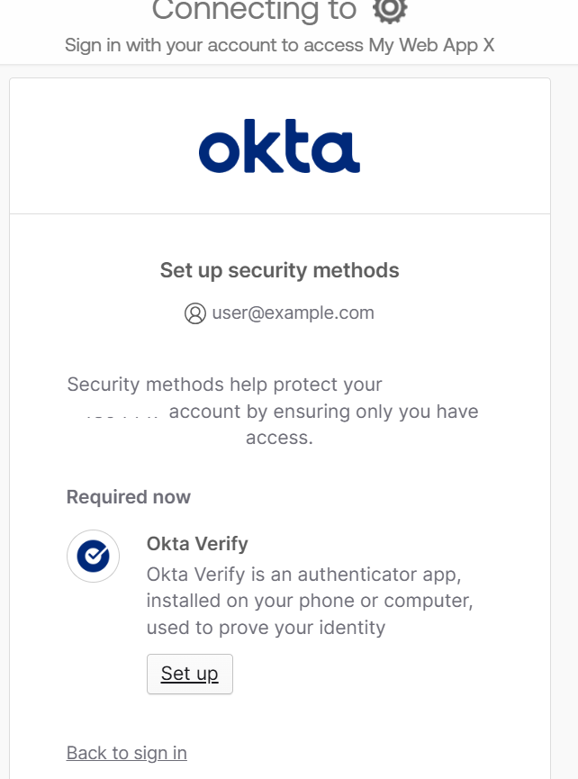
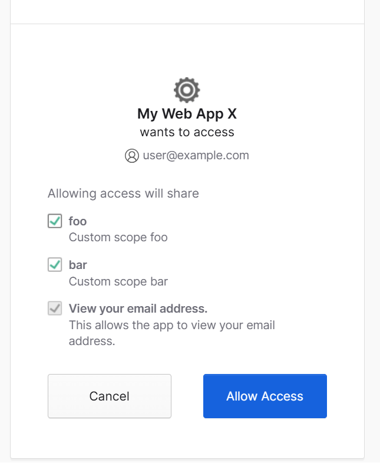
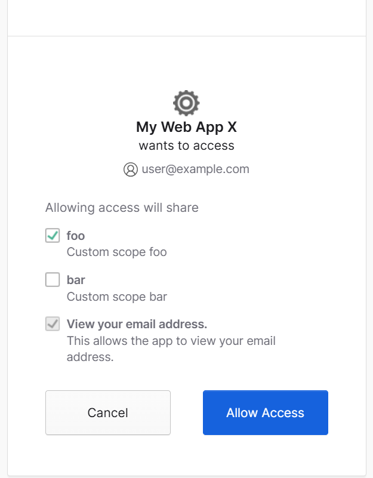
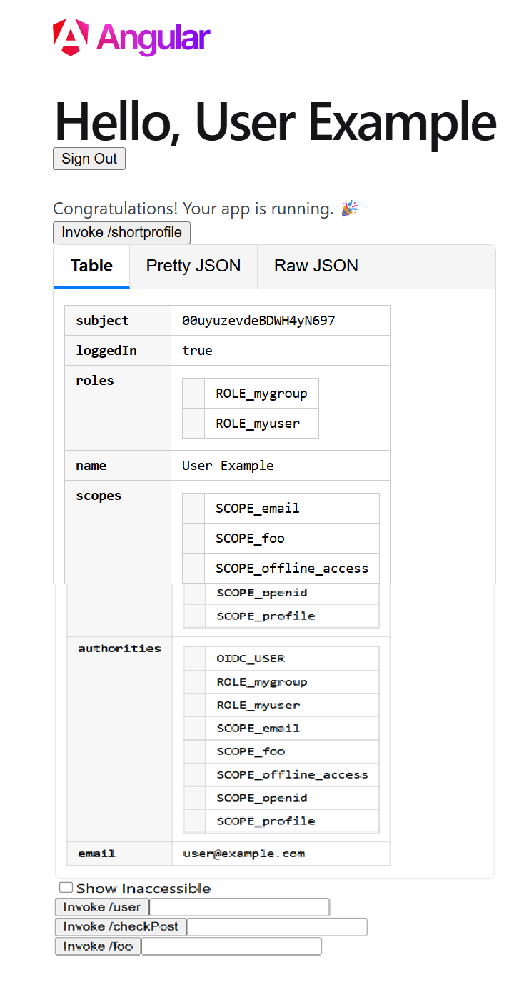
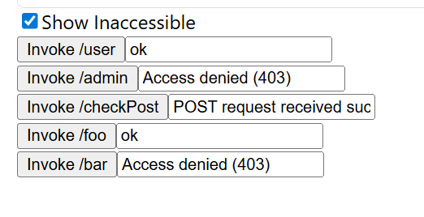

### Run the application
mvn -pl bff-spring-projs/spring.oidc.bff spring-boot:run -P berun -Dokta.tenant.id=[TENANT_ID] -Dokta.oauth2.client-id=[CLIENT_ID] -Dokta.oauth2.client-secret=[CLIENT_SECRET]

Visit http://localhost:8081/   

Few quick checks.  
Press the Invoke . check post button.  
 

After Show Inaccessible and Pressing all buttons.   

Lets look at the Sign In button now and click it.    

Lets look at the Sign In button now and click it.    

You can force the scope slection as next screen if needed by appending "&prompt=consent"  in the url.   
Scope selection screen may show up first time automatically and this appending need not be done.  

Lets deselect bar from the scopes.  

Post login   

Lets click show Inaccessible and click all the buttons there:  

